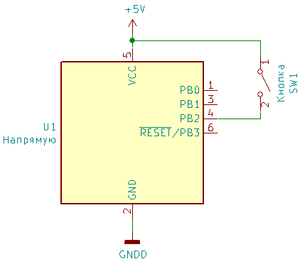
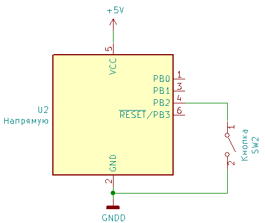
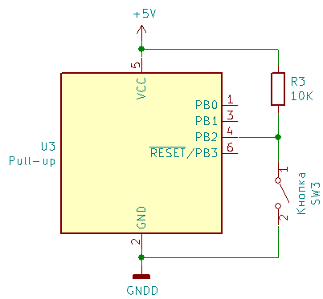
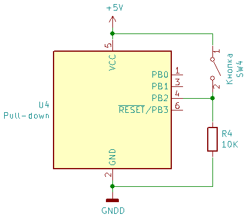
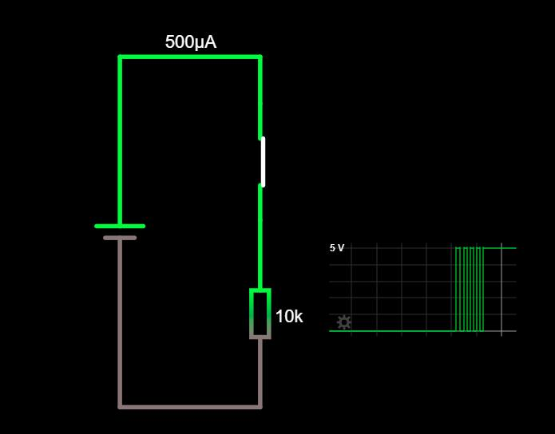
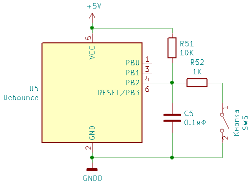
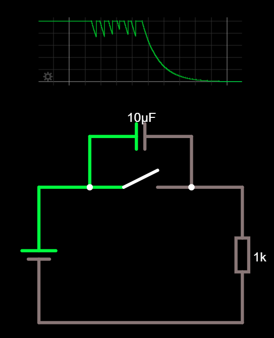
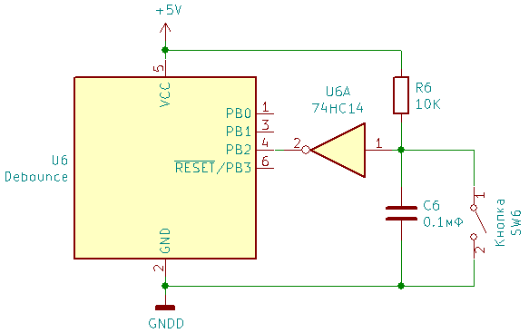
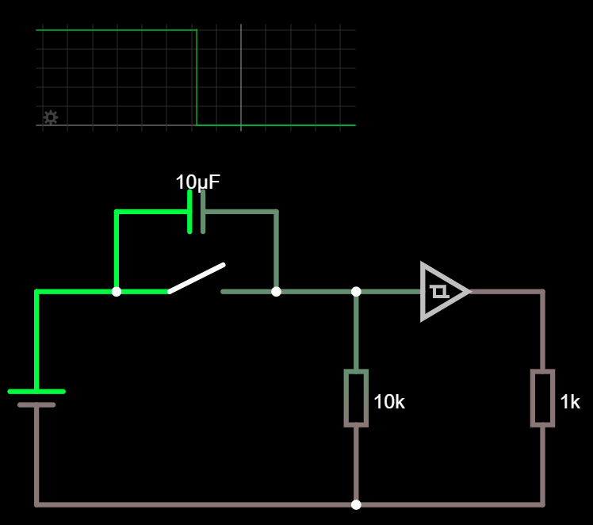

# Работа с кнопкой

Работа с кнопкой в первом приближении выглядит очень простой, но есть несколько проблем. **Первая - требуется подтяжка, вторая - дребезг кнопок.**

Вариантов включения всего два - кнопка подключает пин контроллера **к питанию**



или **к земле**



Но есть определенные проблемы с таким подходом. Для этого надо посмотреть на упрощенную схему подключения пина контроллера.


Здесь мы видим условную емкость пина контроллера Cpin, небольшая паразитная емкость у порта будет в любом случае. На что это влияет?

1. Скорость перехода между состояниями будет не мгновенной, а с плавным переходом.
2. После отпускания кнопки будет оставаться определенный электрический заряд, который будет делать вид, что кнопка всё еще нажата. Заряд постепенно снизится до нуля за счет внутреннего сопротивления между пином контроллера и питанием, но это будет не мгновенно.
3. Любая электростатическая помеха будет восприниматься как нажатие кнопки.

## Подтяжка

Для компенсации внутренней емкости пина контроллера и повышения помехозащищенности обычно используют вариант с подтяжкой пина контроллера к питанию или земле через резистор, сопротивлением чаще всего 10 кОм. Если кнопка не нажата - любые остатки заряда или помехи стекают через резистор.

------

#### Подтягивающий резистор

Вариант с **подтягивающим** (к питанию) резистором. В этом случае пока кнопка не нажата - на пин приходит напряжение питания, при считывании получаем HIGH. Нажатие кнопки подключает пин напрямую к земле, при считывании получаем LOW.



------

#### Стягивающий резистор

Вариант со **стягивающим** (к земле) резистором. В том случае до нажатия кнопки пин подключен к земле, при считывании получаем LOW. Нажатие кнопки замыкает пин на питание и получаем HIGH,



В обоих случаях в момент нажатия кнопки от земли к питанию будет протекать ток. Насколько большой?
$$
R = U/I (закон Ома) 
$$

$$
R = 10 000 Ом, U = 5В, I = ?
$$

$$
I = U/R = 5/10000 = 0.5 мА
$$

Заметно меньше чем потребляет микроконтроллер, так что переживать не о чем.

#### Внутренняя подтяжка

В случае с Arduino (ATMega328, ATmega32U4) есть возможность задействовать внутренний подтягивающий резистор (Rpu с упрощенной схемы), его сопротивление может колебаться в пределах 20-50 кОм, если судить по [технической спецификации](hardware.md), в этом случае **внешний резистор не требуется**, достаточно активировать внутреннюю подтяжку при настройке. 

**ВАЖНО: в этом случае сигнал будет инвертированный**

```c++
setup() {
	pinMode(pin, INPUT_PULLUP);  
}

loop() {
    if (digitalRead(pin) == LOW) {
        //кнопка НАЖАТА!!!! ^^^
    }
}
```

В случае работы с другими контроллерами - изучаем спецификации, могут быть как подтягивающие, так и стягивающие резисторы или не быть вообще.

## Дребезг

Вторая проблема заключается в том, что кнопка внутри себя представляет подпружиненную пластину, которая при нажатии может успеть еще несколько раз изогнувшись ударить по контакту. В этом случае микроконтроллер зафиксирует несколько нажатий кнопки.

Пример из симулятора:



### Аппаратное устранение дребезга

#### Просто конденсатор

С дребезгом можно бороться аппаратно. Самый простой вариант - поставить параллельно кнопке небольшой конденсатор. 

Изображен пример с подтягивающим резистором. 

При нажатии кнопки конденсатор будет разряжаться через резистор R52, причем не мгновенно. В случае дребезга кнопки - на пин все-равно некоторое время будет продолжать поступать напряжение, близкое к напряжению питания. Есть достаточно большая вероятность, что в этом случае процесс дребезга пройдет пока контроллер "думает", что кнопка все ещё нажата. 

При отпускании - конденсатор заряжаясь, опять же не мгновенно, будет некоторое время удерживать напряжение на входе контроллера близкое к нулю.



Недостаток подхода - 

1. Конденсаторы денег стоят. Их монтаж тоже. Вопрос пары рублей, но...

2. При дребезге все-равно будут колебания напряжения, которые контроллер может принять за последовательные нажатия кнопки.
   

#### Триггер Шмитта

Немного усложнив схему, можно избавиться от колебаний напряжения, повысив стабильность. Часто используемый вариант - триггер Шмитта. Цена вопроса - микросхема на 6 триггеров стоит около 15 рублей, плюс по 1 рублю за конденсатор. 



Благодаря внутреннему гистерезису (википедия в помощь), он не переключается мгновенно из состояния в состояние, а удерживает до последнего высокий или низкий уровень. Можно посмотреть пример в симуляторе. **#fixme**




### Программное устранение дребезга

Алгоритм простой - после прихода сигнала об изменении состояния кнопки - запомнить полученное состояние, немного подождать (5-50 миллисекунд), измерить еще раз сигнал и если он не изменился, фиксируем факт нажатия/отпускания кнопки. Или считаем ошибочным и игнорируем.

Еще имеет смысл для кнопки хранить время предыдущего нажатия. Если разница во времени слишком мала - дребезг.

### Разница в подходах

В зависимости от задачи можно обойтись простым программным вариантом. Но если требуется высокая надежность, то лучше использовать аппаратное решение.

# Список литературы:

1. Конденсатор и RC цепочка
   http://easyelectronics.ru/kondensator-i-rc-cepochka.html

2. О фильтрах дребезга 
   [Википедия](https://ru.wikipedia.org/wiki/Триггер_Шмитта#В_фильтрах_дребезга_электромеханических_ключей)

3. Методы борьбы с дребезгом кнопок
   https://hackaday.com/2015/12/09/embed-with-elliot-debounce-your-noisy-buttons-part-i/

4. Симулятор
   http://www.lushprojects.com/circuitjs/ 