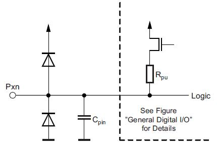

Работа с GPIO

**Интерфейс ввода/вывода общего назначения** (англ. general-purpose input/output, **GPIO**) — интерфейс для связи между компонентами компьютерной системы, к примеру микропроцессором и различными периферийными устройствами. Контакты GPIO могут выступать как в роли входа, так и в роли выхода — это, как правило, конфигурируется. GPIO контакты часто группируются в порты.

Позволяет подавать сигнал для управления внешними устройствами или получать данные о наличии сигнала.

Упрощенная схема пина для ATMega328p выглядит так (datasheet, стр. 58) :



В общем случае вход может находиться в режимах:

- **floating** - "плавающий", без подтягивающих резисторов, с высоким входным сопротивлением, режим HI-Z

- **pull-up**  - с внутренним, подтягивающим к высокому уровню резистором); 

- **pull-down** - с подтягивающим к низкому уровню резистором (в случае с ARDUINO недоступен);

- **analog** - аналоговый вход.

Выход может быть: 

- **push-pull** - двухтактный; 
- **open-drain** - с открытым стоком; 
- alternate function push-pull - двухтактный для альтернативной функции; 
- alternate function open-drain - с открытым стоком для альтернативной функции.


## Инициализация

Для начала работы с пином его требуется инициализировать, для этого используется функция [pinMode](https://www.arduino.cc/reference/en/language/functions/digital-io/pinmode/) [[ru](http://arduino.ru/Reference/PinMode)]:
**pinMode(pin, mode)**
где 

- **pin** - номер пина от 0 до 13 в случае с UNO, Micro, Nano, либо A0-A7
- **mode** - режим - **INPUT** (вход), **INPUT_PULLUP** (вход с подтягивающим резистором ~ 20-50 кОм, на схеме - Rpu), **OUTPUT** (выход)

```c++
setup() {
	pinMode(pin, INPUT);    
}
```

## Подаем сигнал

В дальнейшем можно подать значение HIGH (1) или LOW (0) на пин с помощью функции [digitalWrite](https://www.arduino.cc/reference/en/language/functions/digital-io/digitalwrite/) [[ru](http://arduino.ru/Reference/DigitalWrite)]:

**digitalWrite(pin, value)**

где 

- **pin** - номер пина от 0 до 13 в случае с UNO, Micro, Nano, либо A0-A7

- **value** - значение, если 0 - LOW, если любое другое значение - HIGH. Тип данных на входе в функцию - uint8_t, это значения от 0 до 255, любые другие значения - уже вопрос к компилятору. 
```c++
loop() {
	digitalWrite(pin, HIGH);
}
```

## Принимаем сигнал

Для считывания значений используется функция [digitalRead](https://www.arduino.cc/reference/en/language/functions/digital-io/digitalread/) [[ru](http://arduino.ru/Reference/DigitalRead)]:

**digitalRead(pin)**
где

- pin - номер пина от 0 до 13 в случае с UNO, Micro, Nano, либо A0-A7
```c++
loop() {
    int val = digitalRead(pin);
    if (val == HIGH) {
        
    } else {
        
    }
}
```

## Ждём сигнала

Мы можем крутиться в функции loop(), бесконечно проверяя "а не нажата ли кнопка", а можно попросить контроллер, чтобы он выполнил функцию в случае, если придёт сигнал.

При возникновении внешнего события на порту возникает прерывание, при этом вызывается функция - обработчик прерывания. Прерывание вклинивается в поток выполнения, останавливая  выполнение программы, после завершения обработки прерывания выполнение основной программы продолжается. Поэтому желательно в обработчике прерывания выполнять минимум действий.

Внутри обработчика прерывания **не будет работать** функция **delay()** и не будет увеличиваться значение от функции **millis()**. Кроме того, последовательные данные, посылаемые во время работы этой функции, могут быть утеряны.

Также все **переменные**, которые будут модифицированы внутри этой функции, нужно объявлять как **volatile**. 

**Не на всех пинах можно использовать прерывание.** 
Для UNO, Nano доступны только 2 и 3, 
для Micro - 0, 1, 2, 3, 7, 
для ESP8266 - все, кроме 16. 

Более подробно - смотреть в технических спецификациях или на сайте [авторов контроллера](https://www.arduino.cc/reference/en/language/functions/external-interrupts/attachinterrupt/).

Для установки обработчика прерывания используется функция [attachInterrupt](https://www.arduino.cc/reference/en/language/functions/external-interrupts/attachinterrupt/) [[ru](http://arduino.ru/Reference/AttachInterrupt)]:
**attachInterrupt(digitalPinToInterrupt(pin), ISR, mode)**
где

- **digitalPinToInterrupt(pin)** - используется промежуточная функция, которая даёт номер пина в нужном виде
- **ISR** - название функции, обработчика прерывания. Параметры в неё не передаются, возвращать она ничего не должна.
- **mode** - в какой момент будет вызываться обработчик прерывания
  - **LOW** - когда на пине LOW (*недоступно на ESP8266*)
  - **CHANGE** - каждый раз, когда состояние пина меняется - LOW/HIGH
  - **RISING** - в момент, когда начинается переход от LOW к HIGH
  - **FALLING** - при переходе от HIGH к LOW

[Пример](https://www.arduino.cc/reference/en/language/functions/external-interrupts/attachinterrupt/):

```c++
const byte ledPin = 13;
const byte interruptPin = 2;
volatile byte state = LOW;

void setup() {
  pinMode(ledPin, OUTPUT);
  pinMode(interruptPin, INPUT_PULLUP);
  attachInterrupt(digitalPinToInterrupt(interruptPin), blink, CHANGE);
}

void loop() {
  digitalWrite(ledPin, state);
}

void blink() {
  state = !state;
}
```


Для выключения обработчика прерывания используется функция [detachInterrupt](https://www.arduino.cc/reference/en/language/functions/external-interrupts/detachinterrupt/) [[ru](http://arduino.ru/Reference/DetachInterrupt)]:

**detachInterrupt(digitalPinToInterrupt(pin))**

поведение аналогично функции назначения прерывания.

## Работа через регистры

Есть регистры (адреса с уникальными названиями в памяти контроллера) для управления режимом порта напрямую, в обход функций Arduino.

- PORTx
- DDRx
- PINx

Пример кода из документации:

PORTB = (1<<PB7)|(1<<PB6)|(1<<PB1)|(1<<PB0);
DDRB = (1<<DDB3)|(1<<DDB2)|(1<<DDB1)|(1<<DDB0);