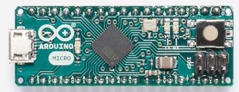

# Матчасть

Чаще всего имеем дело с самой простой версией - Arduino **UNO**, микроконтроллер ATMega328p

Еще часто используется более компактный вариант **Nano**, микроконтроллер ATmega328

Или есть версия **Micro**, где используется более новый микроконтроллер ATmega32U4

Между ними есть небольшие различия

|                                                              | UNO                                                          | NANO                                                         | MICRO                                                        |
| ------------------------------------------------------------ | ------------------------------------------------------------ | ------------------------------------------------------------ | ------------------------------------------------------------ |
| Рабочее напряжение, В                                        | 5                                                            | 5                                                            | 5                                                            |
| Напряжение питания, В                                        | 7-12                                                         | 7-12                                                         | 7-12                                                         |
| GPIO пины                                                    | 14                                                           | 22                                                           | 20                                                           |
| Пины с поддержкой ШИМ (PWM)                                  | 6                                                            | 6                                                            | 7                                                            |
| Аналоговые входы                                             | 6                                                            | 8                                                            | 12                                                           |
| Сила тока через единичный пин                                | 20 мА                                                        | 40 мА                                                        | 20 мА                                                        |
| Сила тока через пин 3.3 В                                    | 50 мА                                                        | 50 мА                                                        | 50 мА                                                        |
| Объем SRAM (оперативная память)                              | 2048 Б                                                       | 2048 Б                                                       | 2560 Б                                                       |
| Объем FLASH                                                  | 32 кБ                                                        | 32 кБ                                                        | 32 кБ                                                        |
| Объем EEPROM (энергонезависимая память)                      | 1 кБ                                                         | 1 кБ                                                         | 1 кБ                                                         |
| Частота                                                      | 16 МГц                                                       | 16 МГц                                                       | 16 МГц                                                       |
| **Datasheet**                                                |                                                              |                                                              |                                                              |
| Диапазон напряжений питания                                  | 1.8 - 5.5V                                                   | 2.7 - 5.5V                                                   | 2.7 - 5.5V                                                   |
| Поддержка периферии                                          | 1-UART, 2-SPI, 1-I2C                                         | 1-UART, 2-SPI, 1-I2C                                         | 1-UART, 2-SPI, 1-I2C                                         |
| Циклов перезаписи FLASH                                 | 10000                                                        | 10000                                                        | 10000                                                        |
| Циклов перезаписи EEPROM                                | 100000                                                       | 100000                                                       | 100000                                                       |
| 8 бит таймеры                                                | 2                                                            | 2                                                            | 1                                                            |
| 16 бит таймеры                                               | 1                                                            | 1                                                            | 2                                                            |
| Часы реального времени (если установить отдельный кварцевый резонатор) | +                                                            | +                                                            | -                                                            |
| ADC                                                          | 8 каналов 10 бит                                        | 8 каналов 10 бит                                        | 12 каналов 10 бит                                       |
| Режимы сна                                                   | Idle,  ADC noise reduction,  power-save,  power-down,  standby, extended standby | Idle,  ADC noise reduction,  power-save,  power-down,  standby, extended standby | Idle,  ADC noise reduction,  power-save,  power-down,  standby, extended standby |
| Поддержка JTAG                                               | -                                                            | -                                                            | +                                                            |
| Поддержка USB 2.0                                            | -                                                            | -                                                            | +                                                            |

Более детально про каждый контроллер можно узнать в технических спецификациях (datasheet), все вопросы лучше уточнять в первоисточниках, поскольку при чужих пересказах некоторые вещи могут теряться.

[ATMega328](ATmega328_Datasheet.pdf) или [внешняя ссылка](http://www.mouser.com/pdfdocs/gravitech_atmega328_datasheet.pdf)
[ATMega328p](ATmega328P_Datasheet.pdf) или [внешняя ссылка](http://ww1.microchip.com/downloads/en/DeviceDoc/Atmel-7810-Automotive-Microcontrollers-ATmega328P_Datasheet.pdf)
[ATmega32U4](ATmega16U4-32U4_Datasheet.pdf) или внешняя ссылка

В случае с Arduino Micro (**ATmega32U4**) контроллер аппаратно поддерживает **USB 2.0**, поэтому контроллер можно использовать для эмуляции клавиатуры, например, в отличие от двух других, где взаимодействие с USB берёт на себя отдельный контроллер USB-2-Serial, который умеет только представляться виртуальный COM портом и используется лишь для прошивки и обмена данными.