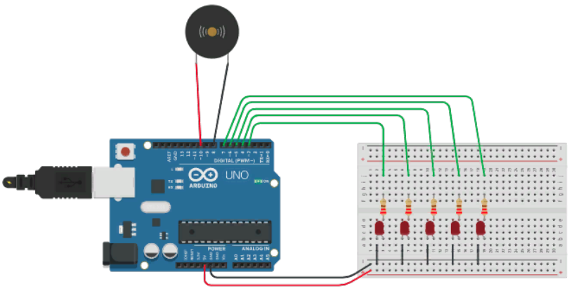

# 1. Кнопка

https://www.tinkercad.com/things/dzfZy6MgvMd

# 2. АЦП

[02_arduino_potentiometer](https://www.tinkercad.com/things/dly0bDuBOBn-02arduinopotentiometer)

# 3. 7-сегментный индикатор

https://www.tinkercad.com/things/0IGNG6lJQqo

# 4. Сдвиговый регистр

https://www.tinkercad.com/things/2iXHQT8dDt4

# 5. RGB-лента

https://www.tinkercad.com/things/aMw1F0GoN2m

# 6. ИК пульт

https://www.tinkercad.com/things/gYRxIxD3n8B

# 7. Система безопасности

https://www.tinkercad.com/things/jaBbJDvaS3K

Рекомендация: строить работу логики на основе конечного автомата.

# 8. Асинхронность

https://www.tinkercad.com/things/6lcrpLedn81

Задача - проигрывать музыку и мигать светодиодами, обходясь без delay() или аналогичных функций.

# 9. Счетчик посетителей

https://www.tinkercad.com/things/4rByfMGiR6J

